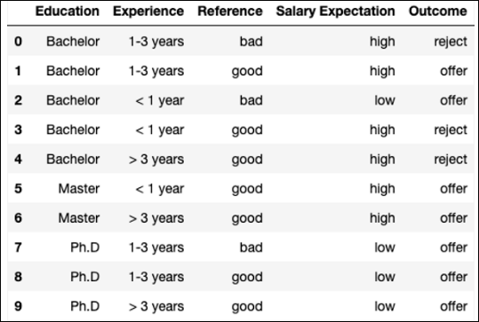
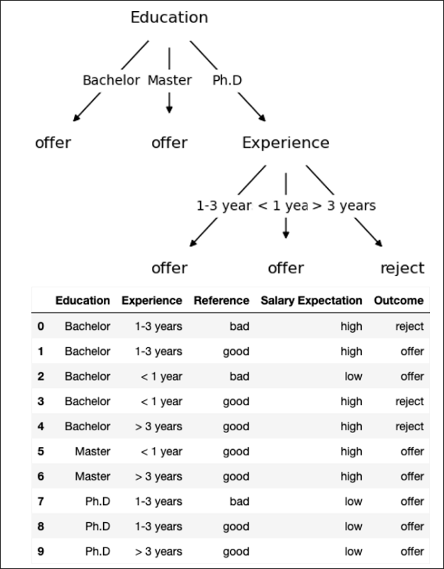

<frontmatter>
title: "AY23/24 CS2109S Midterm Practice"
</frontmatter>

# AY23/24 CS2109S Midterm Practice

This is a collection of practice questions from the AY23/24 CS2109S midterm.

---

## Search Formulation

<question type="mcq" header="Question 1: Spaceship Transport">

Captain Picard is leading a mission to transport n groups of people from different home planets [g₁, ..., gₙ] using m spaceships [s₁, ..., sₘ]. Here, gᵢ denotes the number of people in the i-th group, and sⱼ denotes the capacity of the j-th spaceship. Each group of people cannot be broken apart and must be in the same ship. Picard needs to assign each group to a ship and ensure that all groups are assigned to spaceships. At one time, Picard can only allow one group to enter or exit one spaceship. Since the spaceships will depart tomorrow, Picard must come up with an efficient plan, i.e., a plan with the smallest number of actions.

Suppose that you use the following state representation:
- [z₁, ..., zₘ₊₁] where zᵢ is the set of groups that are assigned to the spaceship i for 1 ≤ i ≤ m. zₘ₊₁ is the set of unassigned groups.

Consider the following invariants, initial states, goal tests, and actions:

**Invariants:**
- I₁: The number of people in each spaceship must not exceed its capacity.
- I₂: The union of all groups in all spaceships and unassigned groups must be the same as {1, ..., n}.
- I₃: Total number of people in all spaceships must be the same as the total capacity of all spaceships

**Initial States:**
- S₁: All spaceships are empty and all groups are unassigned
- S₂: Randomly assign each group to a spaceship or let it unassigned

**Goal test:**
- G₁: The union of all groups in all spaceships must be the same as {1, ..., n}.
- G₂: No unassigned groups

**Actions:**
- A₁: Move each x ∈ zₘ₊₁ to each zᵢ where i ≤ m
- A₂: Move each x ∈ zᵢ to zₘ₊₁ for each i ≤ m
- A₃: Swap each x ∈ zᵢ with each y ∈ zⱼ for any (random) i, j

Which of the above invariant, initial state, goal test, and action tuple(s) is/are reasonable?

  <q-option>A. I₁ & I₂ − S₁ − G₁ − A₁ & A₂ & A₃</q-option>
  <q-option correct reason="Any answers that contain A₃ is incorrect because swapping action is not possible based on the description i.e., 'Picard can only allow one group to enter or exit one spaceship'. Any answers that contain I₃ is incorrect because it is not necessary that the number of people in all spaceships equals the combined capacity of all spaceships.">B. I₁ & I₂ − S₁ − G₁ & G₂ − A₁</q-option>
  <q-option>C. I₁ & I₂ − S₂ − G₁ & G₂ − A₃</q-option>
  <q-option>D. I₁ & I₃ − S₁ − G₁ & G₂ − A₁ & A₂ & A₃</q-option>
  <q-option>E. I₁ & I₃ − S₂ − G₁ − A₁ & A₂</q-option>
  <q-option>F. I₁ & I₃ − S₂ − G₁ & G₂ − A₁ & A₂ & A₃</q-option>
  <q-option>G. I₁ & I₂ & I₃ − S₁ − G₂ − A₂ & A₃</q-option>
  <q-option>H. I₁ & I₂ & I₃ − S₁ − G₁ & G₂ − A₁ & A₂</q-option>
  <q-option>I. I₁ & I₂ & I₃ − S₂ − G₁ & G₂ − A₁ & A₂ & A₃</q-option>
  <q-option>J. None of the above</q-option>

</question>

---

## Uninformed Search

<question type="mcq" header="Question 2: Spaceship Transport - State Space">

Using the same Spaceship Transport problem formulation:

State representation: [x₁, ..., xₙ] where xᵢ ∈ [0, ..., m] represents the assignment of group i to a spaceship among the m spaceships, 0 means not assigned.

Invariant:
- xᵢ ∈ [0, ..., m]
- Total number of people in each spaceship is less than the capacity

Initial state: [0, ..., 0], all zero (unassigned)

Goal test: [x₁, ..., xₙ] where xᵢ ∈ [1, ..., m] (all assigned)

Actions: Set each xᵢ to 0, 1, ..., or m. i.e., n*(m+1) actions

Is it true that the search formulation results in a state space where a state can be visited multiple times? Note: we do not care about the search algorithms in this question since we are asking about state space, not search tree/graph.

  <q-option correct reason="Based on the action definition, xᵢ can be set to any value in [0, ..., m]. Thus, we can revisit any state multiple times.">A. True</q-option>
  <q-option>B. False</q-option>

</question>

<question type="mcq" header="Question 3: Multiple Goal States">

Is it true that the search formulation results in a state space with many goal states?

  <q-option correct reason="It is possible that the solution is not unique. For instance, suppose that we have 2 spaceships with the same capacity of 10 and two group of people (10 people each). Then, the goal states are [1, 2] and [2, 1].">A. True</q-option>
  <q-option>B. False</q-option>

</question>

<question type="checkbox" header="Question 4: Finite Search Tree Algorithms">

Which of the following tree search algorithm(s) can we employ such that the search tree is finite (if there is a solution)?

  <q-option correct>A. Breadth-first search (BFS)</q-option>
  <q-option reason="DFS is incorrect because the action is reversible and DFS can get stuck in an infinite loop by going back and forth between states, e.g., set xᵢ to 0, then 1, then 0, etc.">B. Depth-first search (DFS)</q-option>
  <q-option correct reason="UCS with constant cost is the same as BFS.">C. Uniform-cost search (UCS) with constant cost</q-option>
  <q-option correct reason="Depth-limited search will always terminate and thus is finite">D. Depth-limited search with BFS</q-option>
  <q-option correct reason="Depth-limited search will always terminate and thus is finite">E. Depth-limited search with DFS</q-option>
  <q-option correct reason="BFS, IDS, and UCS will explore a finite number of states if there is a solution since the branching factor is finite">F. Iterative deepening search (IDS)</q-option>
  <q-option>G. None of the above</q-option>

</question>

<question type="checkbox" header="Question 5: Terminating Search Algorithms">

Which of the following tree search algorithm(s) can we employ such that the search always terminates (including if there is no solution)?

  <q-option reason="BFS, UCS, and IDS may not terminate if there is no solution, i.e., they will keep on searching and revisiting previously visited states.">A. Breadth-first search (BFS)</q-option>
  <q-option reason="DFS may get stuck in an infinite loop as explained previously.">B. Depth-first search (DFS)</q-option>
  <q-option reason="BFS, UCS, and IDS may not terminate if there is no solution, i.e., they will keep on searching and revisiting previously visited states.">C. Uniform-cost search (UCS) with constant cost</q-option>
  <q-option correct reason="Depth-limited search will always terminate since the depth is limited and the branching factor is finite.">D. Depth-limited search with BFS</q-option>
  <q-option correct reason="Depth-limited search will always terminate since the depth is limited and the branching factor is finite.">E. Depth-limited search with DFS</q-option>
  <q-option reason="IDS definition in the lecture is ambiguous. The usual implementation of IDS uses no max depth limit, so it runs DLS from 0 depth to an infinite depth.">F. Iterative deepening search (IDS)</q-option>
  <q-option>G. None of the above</q-option>

</question>

<question type="checkbox" header="Question 6: Complete Search Algorithms">

Which of the following tree search algorithm(s) can we employ such that the search always finds an answer (valid sequence of moves) if a solution exists?

  <q-option correct>A. Breadth-first search (BFS)</q-option>
  <q-option reason="DFS may get stuck in an infinite loop as explained previously.">B. Depth-first search (DFS)</q-option>
  <q-option correct>C. Uniform-cost search (UCS) with constant cost</q-option>
  <q-option reason="Depth-limited search may not find an answer if the depth is not set correctly.">D. Depth-limited search with BFS</q-option>
  <q-option reason="Depth-limited search may not find an answer if the depth is not set correctly.">E. Depth-limited search with DFS</q-option>
  <q-option correct>F. Iterative deepening search (IDS)</q-option>
  <q-option>G. None of the above</q-option>

</question>

<question type="mcq" header="Question 7: Best Tree Search Algorithm">

Which of the following tree search algorithm(s) is/are the best for the problem? Best means the algorithm(s) should be complete, optimal, efficient, and aware if there is no solution.

  <q-option>A. Breadth-first search (BFS)</q-option>
  <q-option>B. Depth-first search (DFS)</q-option>
  <q-option>C. Uniform-cost search (UCS) with constant cost</q-option>
  <q-option>D. Depth-limited search with BFS</q-option>
  <q-option>E. Depth-limited search with DFS</q-option>
  <q-option>F. Iterative deepening search (IDS)</q-option>
  <q-option correct reason="None of the algorithms satisfy the definition of 'Best' given the constraints of the problem formulation.">G. None of the above</q-option>

</question>

<question type="checkbox" header="Question 8: Best Graph Search Algorithm">

Which of the following graph search algorithm(s) is/are the best for the problem? Best means the algorithm(s) should be complete, optimal, efficient, and aware if there is no solution.

  <q-option correct reason="BFS with graph search avoids revisiting states.">A. Breadth-first search (BFS)</q-option>
  <q-option>B. Depth-first search (DFS)</q-option>
  <q-option correct reason="UCS with constant cost is equivalent to BFS.">C. Uniform-cost search (UCS) with constant cost</q-option>
  <q-option>D. Depth-limited search with BFS</q-option>
  <q-option>E. Depth-limited search with DFS</q-option>
  <q-option correct reason="IDS has better space complexity.">F. Iterative deepening search (IDS)</q-option>
  <q-option>G. None of the above</q-option>

</question>

---

## Local Search

<question type="checkbox" header="Question 9: Spaceship Transport Variant #1">

Captain Picard is leading a mission to transport n groups of people from different home planets [g₁, ..., gₙ] using spaceships. Here, gᵢ denotes the number of people in the i-th group, and each spaceship can hold k people. Each group of people cannot be broken apart and must be in the same ship. Picard needs to assign each group to a ship and ensure that all groups are assigned to spaceships. There is no limit to the number of spaceships. In this case, Picard wants to ensure the use of the minimum number of spaceships.

Suppose that we formulate the above problem as a local search problem and use the following state representation: [a₁, ..., aₙ] where aᵢ ≥ 0 represents the assignment of group i to the aᵢ-th spaceship, aᵢ = 0 means group i is not assigned yet.

Consider the following initial states and successor functions:

**Initial states:**
- S₁: [0, ..., 0]
- S₂: aᵢ randomly sampled from [1, ..., n]

**Successor functions:**
- F₁: Select a random group i, then set aᵢ = 0, aᵢ = 1, ..., or, aᵢ = n (there will be n+1 neighbors)
- F₂: Select a random group i where aᵢ = 0, then set aᵢ = 1, aᵢ = 2, ..., or, aᵢ = n (there will be n neighbors)
- F₃: Swap aᵢ with aⱼ for any i, j
- F₄: Select a random group i where aᵢ = 0, then set aᵢ = 1, aᵢ = 2, ..., or, aᵢ = n + swap aᵢ with aⱼ for any i, j, where aᵢ > 0 and aⱼ > 0

The successor function ensures that the number of people in the aᵢ-th spaceship is less than k.

Which of the above initial state and successor function pair(s) is/are reasonable?

  <q-option correct>A. S₁ − F₁</q-option>
  <q-option reason="F₂ is sampling a state through a greedy sequential random sampling">B. S₁ − F₂</q-option>
  <q-option reason="F₃ is simply swapping 0s">C. S₁ − F₃</q-option>
  <q-option correct>D. S₁ − F₄</q-option>
  <q-option correct>E. S₂ − F₁</q-option>
  <q-option reason="F is random sampling one state">F. S₂ − F₂</q-option>
  <q-option correct>G. S₂ − F₃</q-option>
  <q-option correct>H. S₂ − F₄</q-option>
  <q-option>I. None of the above</q-option>

</question>

<question type="mcq" header="Question 10: Hill-Climbing Evaluation Function">

Let:
- s be the current state
- set(x) returns a set of unique items in the list x
- len(x) returns the number of items in a set/list x
- count(x, i) returns the number of items in x that has the value i
- indices(x, i) returns the indices of items in x that has the value i
- f₁(s) = n − count(s, 0)
- f₂(s) = len(set(s))
- f₃(s, i) = Σⱼ∈indices(s,i) gⱼ, i.e., the total number of people in spaceship i if s is the state and i is the index of the spaceship

Suppose that we are doing hill-climbing where we want to maximize an evaluation function. Regardless of the initial state and the successor function, which of the following evaluation function(s) is/are reasonable (i.e., maximizing it/them lead(s) us closer to the objective)?

  <q-option reason="Considering only f₁ is incorrect because it could lead to a trivial solution where each group is assigned to one spaceship.">A. f(s) = f₁(s)</q-option>
  <q-option reason="Considering only 1/f₂ is incorrect because it could lead to a trivial solution where no group is assigned, giving a maximum value.">B. f(s) = 1/f₂(s)</q-option>
  <q-option reason="minᵢ f₃(s, i) is always 0 since i is unbounded (i.e., there is no limit in the number of spaceships).">C. f(s) = minᵢ f₃(s, i)</q-option>
  <q-option reason="f₂ is incorrect because it could lead to maximizing the number of spaceships.">D. f(s) = f₁(s) + Σᵢ gᵢ * f₂(s)</q-option>
  <q-option>E. f(s) = f₁(s) + minᵢ f₃(s, i)</q-option>
  <q-option>F. f(s) = Σᵢ gᵢ/f₂(s) + minᵢ f₃(s, i)</q-option>
  <q-option correct>G. f(s) = f₁(s) + Σᵢ f₃(s, i)/f₂(s)</q-option>
  <q-option>H. None of the above</q-option>

</question>

<question type="checkbox" header="Question 11: Uninformed Search for Optimal Solution">

Using the above state representation, which of the following uninformed search algorithm(s) can we use to find the optimal solution assuming that it exists?

  <q-option correct>A. Breadth-first search (BFS)</q-option>
  <q-option>B. Depth-first search (DFS)</q-option>
  <q-option correct>C. Uniform-cost search (UCS) with constant cost</q-option>
  <q-option>D. DLS with BFS</q-option>
  <q-option>E. DLS with DFS</q-option>
  <q-option correct>F. Iterative deepening search (IDS)</q-option>
  <q-option>G. None of the above</q-option>

</question>

---

## Heuristics: Light Problem

<question type="mcq" header="Question 12: hₐ Admissibility">

The first floor of the DBZ Bank building contains n×n rooms, each equipped with a light. Some of these lights are currently on. Your task is to turn off all the lights on the first floor.

Actions:
1. Move one room to the left/right/up/down with a cost of 1.
2. Stay in the current room and turn off the light in the room if it is on with a cost of 1.
3. Stay in the current room and turn on the light in the room if it is off with a cost of 1.

Note: Turning off the light in room r will also turn off the light in the directly adjacent room to the left if it is currently on.

**hₐ**: The number of rooms with lights on.

Is hₐ admissible for this Light problem?

  <q-option>A. Yes, it is admissible.</q-option>
  <q-option correct reason="Consider a situation where your current position is (0, 2), and the rooms with lights on are (0, 1) and (0, 2). In this case, hₐ = 2, which exceeds the real cost, h* = 1 (turn off the light in room (0, 2)). Thus, hₐ is not admissible.">B. No, it is not admissible.</q-option>

</question>

<question type="mcq" header="Question 13: hₐ Consistency">

Is hₐ consistent for this Light problem?

  <q-option>A. Yes, it is consistent.</q-option>
  <q-option correct reason="Consider a situation where your current position is (0, 2), and the rooms with lights on are (0, 1) and (0, 2). In this case, the next state (n') can be the goal state if we choose to turn off the light in room (0, 2). hₐ(n) = 2 > c(n, a, n') + hₐ(n') = 1 + 0. Thus, hₐ is not consistent.">B. No, it is not consistent.</q-option>

</question>

<question type="mcq" header="Question 14: hᵦ Admissibility">

**hᵦ**: Divide the sum of all Manhattan distances between rooms with light on and your current position by 2.
hᵦ = (Σᵣ∈ᵣ MD(r, p))/2

Is hᵦ admissible for this Light problem?

  <q-option>A. Yes, it is admissible.</q-option>
  <q-option correct reason="Consider a situation where your current position is (3, 3), and the rooms with lights on are {(1, 0), (1, 1), (2, 1), (2, 2)}. In this case, hᵦ = (5+4+3+2)/2 = 7, which exceeds the real cost, h* = 6. Thus, hᵦ is not admissible.">B. No, it is not admissible.</q-option>

</question>

<question type="mcq" header="Question 15: hᵦ Consistency">

Is hᵦ consistent for this Light problem?

  <q-option>A. Yes, it is consistent.</q-option>
  <q-option correct reason="Consider a situation where your current position is (3, 3), and the rooms with lights on are {(1, 0), (1, 1), (2, 1), (2, 2)}. In this case, hᵦ(n) = (5+4+3+2)/2 = 7. If you choose to move from (3, 3) to (3, 2) with a cost of 1, then hᵦ(n') = (4+3+2+1)/2 = 5. hᵦ(n) = 7 > c(n, a, n') + hᵦ(n') = 1 + 5. Thus, hᵦ is not consistent.">B. No, it is not consistent.</q-option>

</question>

<question type="mcq" header="Question 16: hᶜ Admissibility">

**hᶜ**: The maximum Manhattan distance between rooms with lights on and your current position.
hᶜ = maxᵣ∈ᵣ MD(r, p)

Is hᶜ admissible for this Light problem?

  <q-option correct reason="To turn off all the lights, we must turn off the light in the farthest room, rᵦ. There are two cases: In case 1, if the light in the directly adjacent room to the right of rᵦ is off, the actual cost is hᶜ + 1. In case 2, if that light is also on, the actual cost becomes hᶜ. Thus, the actual cost is at least hᶜ, and hᶜ is admissible.">A. Yes, it is admissible.</q-option>
  <q-option>B. No, it is not admissible.</q-option>

</question>

<question type="mcq" header="Question 17: hᶜ Consistency">

Is hᶜ consistent for this Light problem?

  <q-option correct reason="Considering the available actions in the Light problem, hᶜ can be reduced by at most 1 in each step, i.e., hᶜ(n) - hᶜ(n') ≤ 1 = c(n, a, n'). Therefore, hᶜ(n) ≤ hᶜ(n') + c(n, a, n'), and hᶜ is consistent.">A. Yes, it is consistent.</q-option>
  <q-option>B. No, it is not consistent.</q-option>

</question>

---

## Heuristics: Light Variant #1

<question type="mcq" header="Question 18: hᴅ Admissibility">

Light Variant #1: Changing the status of the light in room r will toggle the status of lights in neighboring rooms (up, down, left, right).

**hᴅ**: The minimum Manhattan distance between rooms with lights on and your current position.
hᴅ = minᵣ∈ᵣ MD(r, p)

Is hᴅ admissible for this Light Variant #1 problem?

  <q-option correct reason="To turn off all the lights, we need to turn off the light in the farthest room, rᵦ. To do so, we need at least move to one of its neighboring rooms and change the status of the light in that room. Then the cost is (maxᵣ∈ᵣ MD(r, p)-1)+1 = maxᵣ∈ᵣ MD(r, p) >= hᴅ. Thus, hᴅ is admissible.">A. Yes, it is admissible.</q-option>
  <q-option>B. No, it is not admissible.</q-option>

</question>

<question type="mcq" header="Question 19: hᴅ Consistency">

Is hᴅ consistent for this Light Variant #1 problem?

  <q-option>A. Yes, it is consistent.</q-option>
  <q-option correct reason="Consider a situation where your current position is (3, 3), and the rooms with lights on is (0, 0). In this case, hᴅ(n) = 6. If you choose to turn on the light in room (3, 3) with a cost of 1, then hᴅ(n') = 0. hᴅ(n) = 6 > c(n, a, n') + hᴅ(n') = 1 + 0. Thus, hᴅ is not consistent.">B. No, it is not consistent.</q-option>

</question>

<question type="mcq" header="Question 20: hᴇ Admissibility">

**hᴇ**: Divide the number of rooms with light on by 5.

Is hᴇ admissible for this Light Variant #1 problem?

  <q-option correct reason="Referring to Q21, we can prove that hᴇ is consistent. Since consistency implies admissibility, hᴇ is admissible.">A. Yes, it is admissible.</q-option>
  <q-option>B. No, it is not admissible.</q-option>

</question>

<question type="mcq" header="Question 21: hᴇ Consistency">

Is hᴇ consistent for this Light Variant #1 problem?

  <q-option correct reason="Considering the available actions in the Light Variant #1 problem, the maximum number of lights can be turned off in one step is 5. So hᴇ can be reduced by at most 1 in each step, i.e., hᴇ(n) – hᴇ(n') ≤ 1 = c(n, a, n'). Therefore, hᴇ(n) ≤ hᴇ(n') + c(n, a, n'), and hᴇ is consistent.">A. Yes, it is consistent.</q-option>
  <q-option>B. No, it is not consistent.</q-option>

</question>

<question type="mcq" header="Question 22: hғ Admissibility">

**hғ**: The average of the maximum and minimum Manhattan distances between rooms with lights on and your current position.
hғ = (maxᵣ∈ᵣ MD(r, p) + minᵣ∈ᵣ MD(r, p))/2

Is hғ admissible for this Light Variant #1 problem?

  <q-option correct reason="To turn off all the lights, we need to turn off the light in the farthest room, rᵦ. To do so, we need at least move to one of its neighboring rooms and change the status of the light in that room. Then the cost is (maxᵣ∈ᵣ MD(r, p)-1)+1 = maxᵣ∈ᵣ MD(r, p) >= hғ. Thus, hғ is admissible.">A. Yes, it is admissible.</q-option>
  <q-option>B. No, it is not admissible.</q-option>

</question>

<question type="mcq" header="Question 23: hғ Consistency">

Is hғ consistent for this Light Variant #1 problem?

  <q-option>A. Yes, it is consistent.</q-option>
  <q-option correct reason="Consider a situation where your current position is (3, 3), and the rooms with lights on is (0, 0) and (0, 1). In this case, hғ(n) = (6+5)/2 = 5.5. If you choose to turn on the light in room (3, 3) with a cost of 1, then hғ(n') = (6+0)/2 = 3. hғ(n) = 5.5 > c(n, a, n') + hғ(n') = 1 + 3. Thus, hғ is not consistent.">B. No, it is not consistent.</q-option>

</question>

<question type="mcq" header="Question 24: Best Heuristic for A*">

If you are required to use A* graph search for this Light Variant #1 problem, which heuristic(s) should you pick among hᴅ, hᴇ and hғ?

  <q-option>A. hᴅ</q-option>
  <q-option correct reason="If h(n) is consistent, A* using graph search is optimal. hᴅ and hғ are not consistent, so we need to select hᴇ.">B. hᴇ</q-option>
  <q-option>C. hғ</q-option>
  <q-option>D. None of the above</q-option>

</question>

---

## Decision Tree

<question type="text" header="Question 25: Entropy Calculation">

As DBZ Bank launches its recruitment drive, you are tasked with shortlisting candidates for interviews. You've chosen to construct a decision tree based on the bank's historical data.

What is the entropy of the Outcomes (offer/reject) in the table, rounded to 2 decimal places?

**Expected answer:** 0.88

</question>

<question type="mcq" header="Question 26: Root Node Selection">

You decide to start by creating a one-level decision tree with only one split, using information gain. What is root node for your one-level decision tree?

  <q-option correct>A. Education</q-option>
  <q-option>B. Experience</q-option>
  <q-option>C. Reference</q-option>
  <q-option>D. Salary Expectation</q-option>

</question>

<question type="mcq" header="Question 27: Prediction (Bachelor, <1 year)">

Based on your one-level decision tree created according to information gain. What is the Outcome for the following applicant?

Applicant Information:
- Education: Bachelor
- Experience: <1 year
- Reference: good
- Salary Expectation: low

  <q-option>A. offer</q-option>
  <q-option correct>B. reject</q-option>
  <q-option>C. offer/reject</q-option>

</question>

<question type="mcq" header="Question 28: Prediction (Master, >3 years)">

Based on your one-level decision tree created according to information gain. What is the Outcome for the following applicant?

Applicant Information:
- Education: Master
- Experience: >3 years
- Reference: bad
- Salary Expectation: high

  <q-option correct>A. offer</q-option>
  <q-option>B. reject</q-option>
  <q-option>C. offer/reject</q-option>

</question>

---

## Full Decision Tree

<question type="mcq" header="Question 29: Full Tree Prediction (Bachelor, <1 year) [VOIDED]">

Suppose that you pick "Reference" as the root of your decision tree. Use the data in the table and information gain to create the full decision tree. In case of a tie, the priority order for constructing the tree is Education > Experience > Reference > Salary Expectation.

What is the Outcome for the following applicant according to your full decision tree?

Applicant Information:
- Education: Bachelor
- Experience: <1 year
- Reference: good
- Salary Expectation: low

  <q-option>A. offer</q-option>
  <q-option correct>B. reject</q-option>
  <q-option>C. offer/reject</q-option>

**Note:** Q29 is a duplicate of Q31 and is voided.

</question>

<question type="mcq" header="Question 30: Full Tree Prediction (Master, 1-3 years)">

What is the Outcome for the following applicant according to your full decision tree?

Applicant Information:
- Education: Master
- Experience: 1-3 years
- Reference: good
- Salary Expectation: high

  <q-option correct>A. offer</q-option>
  <q-option>B. reject</q-option>
  <q-option>C. offer/reject</q-option>

</question>

<question type="mcq" header="Question 31: Full Tree Prediction (Bachelor, <1 year)">

What is the Outcome for the following applicant according to your full decision tree?

Applicant Information:
- Education: Bachelor
- Experience: <1 year
- Reference: good
- Salary Expectation: low

  <q-option>A. offer</q-option>
  <q-option correct>B. reject</q-option>
  <q-option>C. offer/reject</q-option>

</question>

<question type="text" header="Question 32: Pruned Tree Leaf Nodes">

If you aim to prune the full decision tree, ensure that each leaf node contains at least 3 training data points. How many leaf nodes in your pruned decision tree?

**Expected answer:** 2 leaf nodes (1 leaf node is also accepted)

</question>

<question type="mcq" header="Question 33: Pruned Tree Prediction">

If you aim to prune the full decision tree, ensure that each leaf node contains at least 3 training data points. According to your pruned decision tree, what is the Outcome for the following applicant?

Applicant Information:
- Education: Master
- Experience: <1 year
- Reference: bad
- Salary Expectation: low

  <q-option correct>A. offer</q-option>
  <q-option>B. reject</q-option>
  <q-option>C. offer/reject</q-option>

</question>

---

## Decision Tree Performance Measurement

<question type="text" header="Question 34: True Positives">

One of your colleagues also design his own decision tree to help with recruitment. Using the data from the table, please figure out the number of True Positives (TP) of his decision tree. Use "offer" as a positive label and "reject" as a negative label.

**Expected answer:** 6

</question>

<question type="text" header="Question 35: False Positives">

Using the data from the table, please figure out the number of False Positives (FP) of his decision tree.

**Expected answer:** 3

</question>

<question type="text" header="Question 36: True Negatives">

Using the data from the table, please figure out the number of True Negatives (TN) of his decision tree.

**Expected answer:** 0

</question>

<question type="text" header="Question 37: False Negatives">

Using the data from the table, please figure out the number of False Negatives (FN) of his decision tree.

**Expected answer:** 1

</question>

<question type="text" header="Question 38: Precision">

Using the data from the table, please figure out the Precision of his decision tree, rounded to 2 decimal places.

**Expected answer:** 0.67

</question>

<question type="text" header="Question 39: Recall">

Using the data from the table, please figure out the Recall of his decision tree, rounded to 2 decimal places.

**Expected answer:** 0.86

</question>

<question type="text" header="Question 40: F1 Score">

Using the data from the table, please figure out the F1 Score of his decision tree, rounded to 2 decimal places.

**Expected answer:** 0.75

</question>

---

## Game Tree & Minimax

<question type="mcq" header="Question 41: Children of State (0,0)">

Consider a two-player game featuring two piles of sticks: one with 2 sticks and the other with 3 sticks. Players alternate turns, selecting to remove either 1 or 3 sticks from one or both piles. If sticks are removed from both piles, the number of sticks taken from each must be equal.

We represent the game state with a monotonically increasing sequence of integers. For instance, (1, 2) represents two piles with 1 and 2 sticks.

Which of the following state(s) is/are the children of state (0,0)?

  <q-option>A. (0,0)</q-option>
  <q-option>B. (0,1)</q-option>
  <q-option>C. (0,2)</q-option>
  <q-option>D. (0,3)</q-option>
  <q-option>E. (1,1)</q-option>
  <q-option>F. (1,2)</q-option>
  <q-option>G. (1,3)</q-option>
  <q-option>H. (2,2)</q-option>
  <q-option>I. (2,3)</q-option>
  <q-option correct>J. None of the above</q-option>

</question>

<question type="checkbox" header="Question 42: Children of State (0,1)">

Which of the following state(s) is/are the children of state (0,1)? Select all that is/are true.

  <q-option correct>A. (0,0)</q-option>
  <q-option>B. (0,1)</q-option>
  <q-option>C. (0,2)</q-option>
  <q-option>D. (0,3)</q-option>
  <q-option>E. (1,1)</q-option>
  <q-option>F. (1,2)</q-option>
  <q-option>G. (1,3)</q-option>
  <q-option>H. (2,2)</q-option>
  <q-option>I. (2,3)</q-option>
  <q-option>J. None of the above</q-option>

</question>

<question type="checkbox" header="Question 43: Children of State (0,2)">

Which of the following state(s) is/are the children of state (0,2)? Select all that is/are true.

  <q-option>A. (0,0)</q-option>
  <q-option correct>B. (0,1)</q-option>
  <q-option>C. (0,2)</q-option>
  <q-option>D. (0,3)</q-option>
  <q-option>E. (1,1)</q-option>
  <q-option>F. (1,2)</q-option>
  <q-option>G. (1,3)</q-option>
  <q-option>H. (2,2)</q-option>
  <q-option>I. (2,3)</q-option>
  <q-option>J. None of the above</q-option>

</question>

<question type="checkbox" header="Question 44: Children of State (0,3)">

Which of the following state(s) is/are the children of state (0,3)? Select all that is/are true.

  <q-option correct>A. (0,0)</q-option>
  <q-option>B. (0,1)</q-option>
  <q-option correct>C. (0,2)</q-option>
  <q-option>D. (0,3)</q-option>
  <q-option>E. (1,1)</q-option>
  <q-option>F. (1,2)</q-option>
  <q-option>G. (1,3)</q-option>
  <q-option>H. (2,2)</q-option>
  <q-option>I. (2,3)</q-option>
  <q-option>J. None of the above</q-option>

</question>

<question type="checkbox" header="Question 45: Children of State (1,1)">

Which of the following state(s) is/are the children of state (1,1)? Select all that is/are true.

  <q-option correct>A. (0,0)</q-option>
  <q-option correct>B. (0,1)</q-option>
  <q-option>C. (0,2)</q-option>
  <q-option>D. (0,3)</q-option>
  <q-option>E. (1,1)</q-option>
  <q-option>F. (1,2)</q-option>
  <q-option>G. (1,3)</q-option>
  <q-option>H. (2,2)</q-option>
  <q-option>I. (2,3)</q-option>
  <q-option>J. None of the above</q-option>

</question>

<question type="checkbox" header="Question 46: Children of State (1,2)">

Which of the following state(s) is/are the children of state (1,2)? Select all that is/are true.

  <q-option>A. (0,0)</q-option>
  <q-option correct>B. (0,1)</q-option>
  <q-option correct>C. (0,2)</q-option>
  <q-option>D. (0,3)</q-option>
  <q-option correct>E. (1,1)</q-option>
  <q-option>F. (1,2)</q-option>
  <q-option>G. (1,3)</q-option>
  <q-option>H. (2,2)</q-option>
  <q-option>I. (2,3)</q-option>
  <q-option>J. None of the above</q-option>

</question>

<question type="checkbox" header="Question 47: Children of State (1,3)">

Which of the following state(s) is/are the children of state (1,3)? Select all that is/are true.

  <q-option>A. (0,0)</q-option>
  <q-option correct>B. (0,1)</q-option>
  <q-option correct>C. (0,2)</q-option>
  <q-option correct>D. (0,3)</q-option>
  <q-option>E. (1,1)</q-option>
  <q-option correct>F. (1,2)</q-option>
  <q-option>G. (1,3)</q-option>
  <q-option>H. (2,2)</q-option>
  <q-option>I. (2,3)</q-option>
  <q-option>J. None of the above</q-option>

</question>

<question type="checkbox" header="Question 48: Children of State (2,2)">

Which of the following state(s) is/are the children of state (2,2)? Select all that is/are true.

  <q-option>A. (0,0)</q-option>
  <q-option>B. (0,1)</q-option>
  <q-option>C. (0,2)</q-option>
  <q-option>D. (0,3)</q-option>
  <q-option correct>E. (1,1)</q-option>
  <q-option correct>F. (1,2)</q-option>
  <q-option>G. (1,3)</q-option>
  <q-option>H. (2,2)</q-option>
  <q-option>I. (2,3)</q-option>
  <q-option>J. None of the above</q-option>

</question>

<question type="checkbox" header="Question 49: Children of State (2,3)">

Which of the following state(s) is/are the children of state (2,3)? Select all that is/are true.

  <q-option>A. (0,0)</q-option>
  <q-option>B. (0,1)</q-option>
  <q-option correct>C. (0,2)</q-option>
  <q-option>D. (0,3)</q-option>
  <q-option>E. (1,1)</q-option>
  <q-option correct>F. (1,2)</q-option>
  <q-option correct>G. (1,3)</q-option>
  <q-option correct>H. (2,2)</q-option>
  <q-option>I. (2,3)</q-option>
  <q-option>J. None of the above</q-option>

</question>

<question type="mcq" header="Question 50: Value of State (1,2) in Depth 1">

What is the value of state (1, 2) in depth 1?

  <q-option correct>A. -1</q-option>
  <q-option>B. 0</q-option>
  <q-option>C. 1</q-option>
  <q-option>D. None of the above</q-option>

</question>

<question type="mcq" header="Question 51: Value of State (2,3) in Depth 0">

What is the value of state (2, 3) in depth 0?

  <q-option>A. -1</q-option>
  <q-option>B. 0</q-option>
  <q-option correct>C. 1</q-option>
  <q-option>D. None of the above</q-option>

</question>

<question type="mcq" header="Question 52: Value of State (0,0) in Depth 3">

What is the value of state (0, 0) in depth 3?

  <q-option>A. -1</q-option>
  <q-option>B. 0</q-option>
  <q-option correct>C. 1</q-option>
  <q-option>D. None of the above</q-option>

</question>

<question type="mcq" header="Question 53: Value of State (0,2) in Depth 1">

What is the value of state (0, 2) in depth 1?

  <q-option>A. -1</q-option>
  <q-option>B. 0</q-option>
  <q-option correct>C. 1</q-option>
  <q-option>D. None of the above</q-option>

</question>

<question type="mcq" header="Question 54: Value of State (0,0) in Depth 5">

What is the value of state (0, 0) in depth 5?

  <q-option>A. -1</q-option>
  <q-option>B. 0</q-option>
  <q-option correct>C. 1</q-option>
  <q-option>D. None of the above</q-option>

</question>

<question type="mcq" header="Question 55: Expected Winner">

Which player do we expect to win?

  <q-option correct>A. First player</q-option>
  <q-option>B. Second player</q-option>
  <q-option>C. Draw</q-option>
  <q-option>D. It depends</q-option>

</question>

---

## Alpha-beta Pruning

<question type="mcq" header="Question 56: Root Value">

Consider the following minimax tree. What is the root value?

  <q-option>A. 0</q-option>
  <q-option>B. 1</q-option>
  <q-option>C. 2</q-option>
  <q-option>D. 3</q-option>
  <q-option>E. 4</q-option>
  <q-option>F. 6</q-option>
  <q-option>G. 7</q-option>
  <q-option>H. 8</q-option>
  <q-option>I. 9</q-option>
  <q-option>J. 12</q-option>
  <q-option>K. 13</q-option>
  <q-option>L. 16</q-option>
  <q-option correct>M. 18</q-option>
  <q-option>N. 19</q-option>

</question>

<question type="checkbox" header="Question 57: Pruned Links (Left-to-Right DFS)">

Suppose we traverse this tree with DFS from left-to-right. Select all the link(s) that would be pruned by alpha-beta pruning algorithm. Select only the links that are directly pruned and not those that are indirectly pruned because they are in a subtree of a pruned link.

  <q-option>A. a</q-option>
  <q-option>B. b</q-option>
  <q-option>C. c</q-option>
  <q-option>D. d</q-option>
  <q-option>E. e</q-option>
  <q-option correct>F. f</q-option>
  <q-option correct>G. g</q-option>
  <q-option>H. h</q-option>
  <q-option>I. i</q-option>
  <q-option>J. j</q-option>
  <q-option>K. k</q-option>
  <q-option>L. l</q-option>
  <q-option>M. m</q-option>
  <q-option>N. n</q-option>
  <q-option>O. o</q-option>
  <q-option>P. p</q-option>
  <q-option>Q. q</q-option>
  <q-option>R. r</q-option>
  <q-option correct>S. s</q-option>
  <q-option correct>T. t</q-option>
  <q-option>U. u</q-option>
  <q-option correct>V. v</q-option>
  <q-option>W. w</q-option>
  <q-option>X. None of the above</q-option>

</question>

<question type="checkbox" header="Question 58: Pruned Links (Right-to-Left DFS)">

Suppose we traverse this tree with DFS from right-to-left. Select all the link(s) that would be pruned by alpha-beta pruning algorithm. Select only the links that are directly pruned and not those that are indirectly pruned because they are in a subtree of a pruned link.

  <q-option>A. a</q-option>
  <q-option>B. b</q-option>
  <q-option>C. c</q-option>
  <q-option>D. d</q-option>
  <q-option>E. e</q-option>
  <q-option>F. f</q-option>
  <q-option>G. g</q-option>
  <q-option>H. h</q-option>
  <q-option>I. i</q-option>
  <q-option>J. j</q-option>
  <q-option>K. k</q-option>
  <q-option>L. l</q-option>
  <q-option>M. m</q-option>
  <q-option>N. n</q-option>
  <q-option>O. o</q-option>
  <q-option>P. p</q-option>
  <q-option>Q. q</q-option>
  <q-option correct>R. r</q-option>
  <q-option correct>S. s</q-option>
  <q-option>T. t</q-option>
  <q-option>U. u</q-option>
  <q-option>V. v</q-option>
  <q-option>W. w</q-option>
  <q-option>X. None of the above</q-option>

</question>
