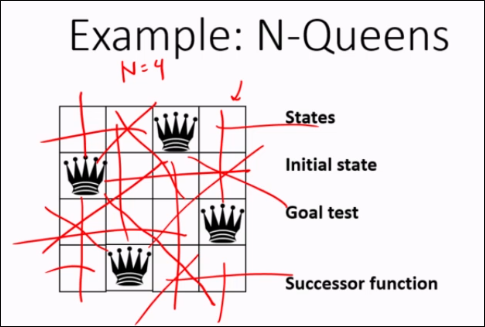
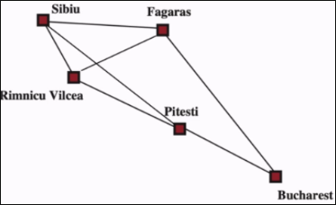
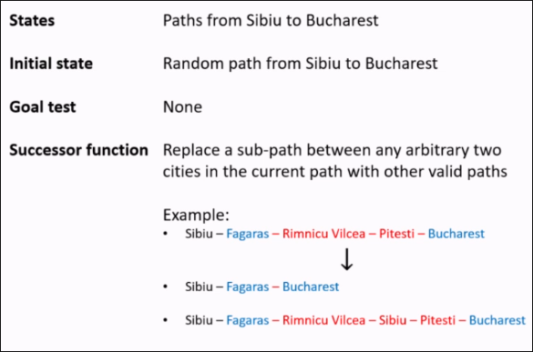
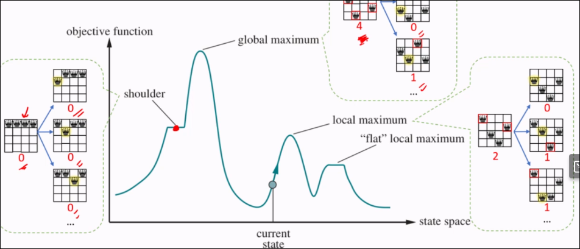
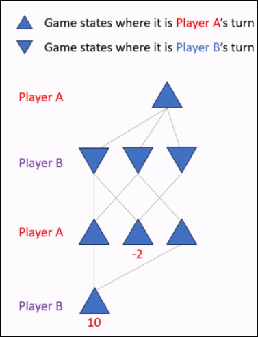
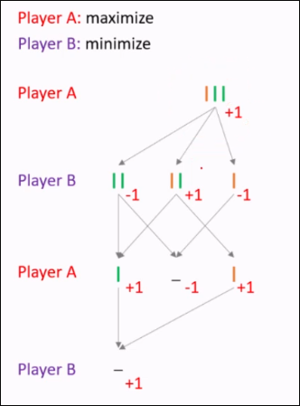
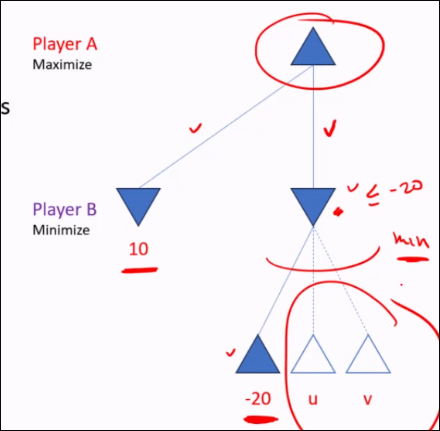
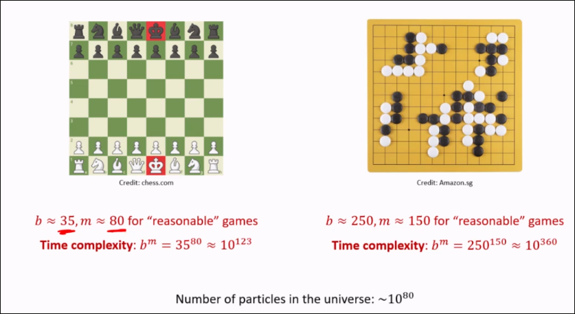
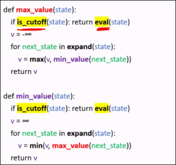
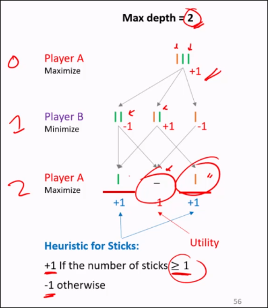

# Local Search


Strategy: Traverse state space by considering only **locally-reachable** states
- Start at a random position in a state space.
- Iteratively move from a state to another "better" neighbouring state
- The solution is the final state after a certain number of steps.

Typically, **incomplete** and **suboptimal

**Any-time** property: longer runtime, often better solution
  - Get a "good enough" solution

<panel header="Recall: Problem formulation" class="ms-4">
<include src="week2.md#formulation" />
</panel>

<br/>

## Problem formulation in Local Search
Problem formulation is slightly different:

States: Represent different configurations or **candidate solution**. They may or may not map to an actual problem state, but are used to represent potential solution.

Initial State: The starting configuration (candidate solution)

Note how there are no action/transition properties in the formulation.

<panel header="N-queens example">

## Example: N-Queens.


Ensure that all queens are safe from each other.

**State** - Configurations of queens on the board

**Initial State** - Random placement of queens, one on each column

**Goal Test** - No two queens threaten each other

**Successor Function** - Move a queen to a different row within the same column

</panel>

<panel header="Minimizing a function example">

  Find an integer x that minimizes a black box function f(x)

  **State** - All possible integers
  
  **Initial State** - Random integer

  **Goal test** - None - there is no real way to check if it's a black box

  **Successor function** - Make change to x, either by increasing/decreasing by 1

</panel>

<br/>

**Question**:
<question type="mcq" header="In local search, the solution is the **final state** rather than the path taken to reach it. Can local search be used to *potentially* find a good solution for shortest path problems?">



  <q-option correct>
    Yes
    <div slot="reason">
        We can model the problem like so:
        
  
  </div>
  </q-option>
  <q-option>
    No
  </q-option>
  <q-option>
    Depends
  </q-option>
</question>

## Evaluation Functions
An evaluation function is a mathematical function used to assess the *quality* of a state.

The function takes in a state as an argument and produces a number.

**Important**: An evaluation function should only return values between $(negative terminal, positive terminal)$. That is, either terminal state should be *more* preferrable than any intermediate state.
```
value = eval(state)
```
This value can either be minimized or maximized.

- *n-queens* - number of "safe" queens, we want to maximize
- minimizing a function - minimize the function f(x) itself

<small>Note: a minimization objective f(x) can be transformed into a maximization objective by defining a new objective f'(x) = -f(x) and vice versa</small>

## Hill climbing algorithm
```python
current_state = initial_state
while True:
  best_successor = a **highest-eval** successor state of current_state
  if eval(best_succcessor) <= eval(current_state):
    return current_state
  current_state = best_successor
```

## State Space Landscape


- **Global Maximum**: The overall highest point or solution across the entire state space that represents the <u>optimal solution</u>
- **Local Maximum**: A point in the state space higher than neighbours.
- **Shoulder** - A region with a **flat** area, making it difficult for the algo to move past.


# Adversarial Search

## Multi-agent problems
A problem that involves multiple agents <u>interacting within an environment</u>, where each has it's own goal(s) and decision-making. Can be cooperative, competitive, mixed-motive.

### Competitive Multi-agent problems
Agents have conflicting goals.

Two-player zero-sum games, where one player's gain is another's loss.

### Turn-taking games
Next state of environment depends <u>not only</u> on our action in the current turn, but also the other agents in the next turn, which are assumed to be **strategic**

<br/>

## Designing an agent <small>for **competitive** multi-agent problems</small>
<panel header="Terminology" class="ms-4">

- Player (Agent): Entity making decisions

- Turn: A phase where a player makes a move

- Move: A decision or action by a player that changes game state

- End state: A state where the game ends, with no further moves possible

- Winning condition: Criteria that defines when a player wins a game

</panel>

### Game tree
A game tree is a graphical representation of all possible states and moves in a game. Not necessarily a tree.

- **Nodes** indicate all possible game state.
- **Edges** show legal moves or transitions between states

The **outcome** of the game is displayed beneath each terminal node (end state).

### Problem Formulation

We now have extra properties in the formulation:

- **Terminal States**: States where the game ends, such as win/lose/draw states. Can be defined as a function.
- **Utility Function**: Outputs the value of a state from the perspective of our agent.
  - Our agent (player A) wants to <u>maximize</u> the utility.
  - In games such as Chess, outcome is win/loss/draw (+1/0/-1)
  - In games such as Go with territory scoring, outcome for player A is some real number.
  - The utility of non-terminal states is typically not known in advance and must be computed.

<panel header="Example: Sticks">

  Two piles of sticks (green/orange)

  Player can take any number of sticks from a single pile

  The player who cannot make any move loses.

  **States** - Configuration of piles
  **Initial State** - A number of green/blue sticks
  **Terminal State** - No stick
  **Actions** - Take 1,2.. stick from one of the piles
  **Transition** - Remove the sticks from the pile
  **Utility Function** - +1/0/-1 for win/draw/lose

</panel>

<br/>

## Algorithm for Adversarial Search: Minimax
Algorithm specifically for a **two player zero-sum** game

Core assumption: all players play <u>optimally</u>

Expand function: `expand(state)`
- For each action, compute: `next_state = transition(state, action)`
- Returns a set of (action, next_state) pairs

Terminal function: `is_terminal(state)`
- Returns true/false

Utility function: `utility(state)`
- Returns a score for the state based on Player A.

```python
def minimax(state):
  (action, v) = max_value(state)
  return action
```

```python
def max_value(state):
  if is_terminal(state): return utility(state)
  v = neg_inf
  for next_state in expand(state):
    v = max(v, minimum value for player A in the next_state)
  return v
```

As we can see, the max_value assumes that the opponent plays optimally by minimizing player A in the `max_value` function.

```python
def min_value(state):
  if (is_terminal(state)): return utility(state)
  v = pos_inf
  for next_state in expand(state):
    v = min(v, max_value(next_state))
  return v
```



So what actually happens in this algo is a step-by-step recursive dive to maximize the minima of a potential branch.

### Analysis
**Time complexity**: Exponential w.r.t. to depth. $O(b^m)$, where b = branching factor & m = max-depth

**Space Complexity**: Polynomial.

**Complete**: Yes, if tree is finite.

**Optimal**: Yes, against optimal opponent.

#### Optimality
Theorem: In any finite, two-player zero-sum game of **perfect** information, the minimax algorithm computes the optimal strategy for both players, guaranteeing the best achievable outcome for each, <u>assuming both play optimally</u>

Theorem: If Player A's opponent **deviates** from optimal play, then for any action taken by Player A, the **utility** obtained by Player A is never less than the utility they would obtain against an optimal opponent.

### The problem with Minimax
**Minimax explores the entire game tree.**

However, evaluating a node sometimes becomes unnecessary, as it won't alter the decision.



## Alpha-Beta Pruning
A variant of minimax that seeks to decrease the number of nodes that are evaluated.

Maintain the best outcomes so far for Player A and Player B:
- <u>Alpha</u> is the highest outcome for player A so far.
- <u>Beta</u> is the lowest outcome for player A so far.

Prune unnecessary nodes.
- At the turn of <u>Player B</u>, if an action leads to a worse outcome for player A, then the rest of the actions are irrelevant; the node will have <u>at most</u> that "worst outcome"
- At the turn of <u>Player A</u>, if an action leads to a better outcome for player A (higher than beta), then the rest of the actions are irrelevant; the node will have <u>at least</u> that outcome which player B is not interested in

<panel header="How to traverse alpha-beta tree">

  1. Set Alpha and Beta to their respective infinities and traverse downwards
  2. Reach a terminal node:
    - MIN node
      - Update Beta to lowest value
    - MAX node
        - Update alpha to maximum value
  3. Propagate change upwards. A Beta value of 6 propagates to the parent's alpha value and vice-versa.

</panel>

**Psuedocode**

```python
def alpha_beta_search(state):
  (action, v) = max_value(state, -inf (alpha), inf (beta))
  return action
```

```python
def max_value(state, alpha, beta):
  if (is_terminal(state)): return utility(state)
  v = -inf
  for next_state in expand(state):
    v = max(v, min_value(next_staet, alpha, beta))
    alpha = max(alpha, v)
    if (v >= beta): return v
  return v
```

```python
def min_value(state, alpha, beta):
  if (is_terminal(state)): return utility(state)
  v = inf
  for next_state in expand(state):
    v = min(v, max_value(next_state, alpha, beta))
    beta = min(beta, v)
    if (v <= alpha): return v
  return v
```

### Alpha-Beta Pruning analysis

Theorem: Alpha-beta pruning <u>does not</u> alter the minimax value, and the optimal move computed for the root node; it only reduces the number of nodes evaluated.

Making full use of alpha-beta pruning requires **meta-reasoning**: reasoning about which computations to do first (e.g. which branch to expand to first?)

Theorem: Good move ordering increases alpha-beta pruning effectiveness; with "perfect ordering", its complexity is $O(b^{\frac{m}{2}})$

<panel header="Alpha-Beta in the real world">

  

  Even with pruning it's quite intractable in the real world!

</panel>

<br/>

## Imperfect Decisions by Using Cutoff on top of Alpha-Beta
Instead of evaluating full tree,
- Cutoff strategy - halt search in middle & estimate value using evaluation function.

Modification: simply start returning an eval function at cutoff:




### Evaluation Function
Assigns score to a game state, indicating favourability to a player.
- If terminal state, use `utlility(state)`
- If not, use a heuristic

Heuristic function is an estimate of utility
- A heuristic should fall somewhere between the minimum and maximum utility for all states.
- Computation must not be too expensive
- In adversarial search, admissibility and consistency properties do not apply

### Inventing a heuristic
- **Relaxed game** - in principle, but usually too costly
  - Chess, each peice can teleport/self-sacrifice
- **Expert Knowledge**
  - Often use features like material count, mobility, safety
- **Learn from data**
  - Heuristic function could be learned from labeled dataset.

<panel header="Sticks game with cutoff">



</panel>

### Optimality

Theorem: In a finite, two-player, zero-sum game, the minimax algorithm with cutoff and an evaluation function returns a move that is <u>optimal</u> with respect to the evaluation function at the cutoff

The move may be <u>suboptimal</u> with respect to the true minimax value
