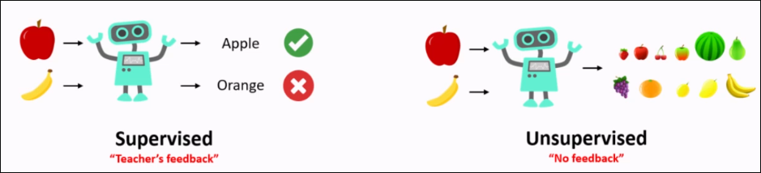
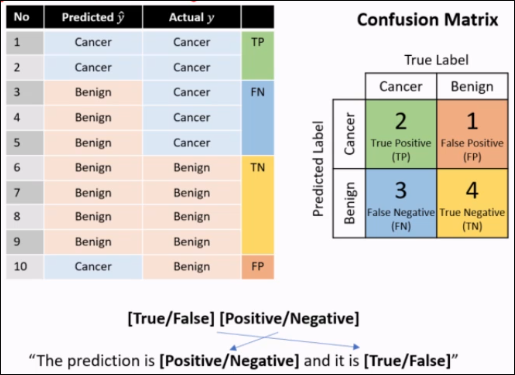
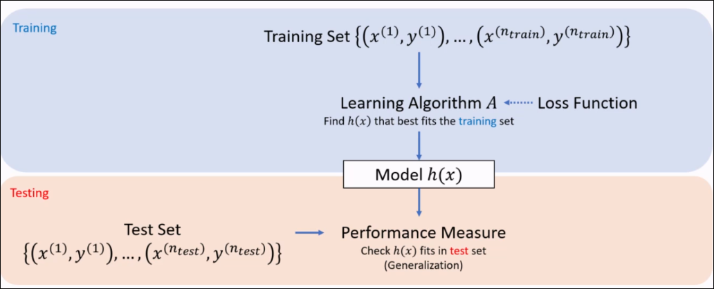
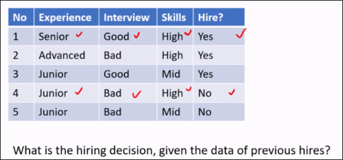
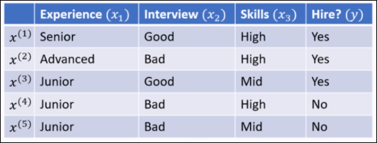
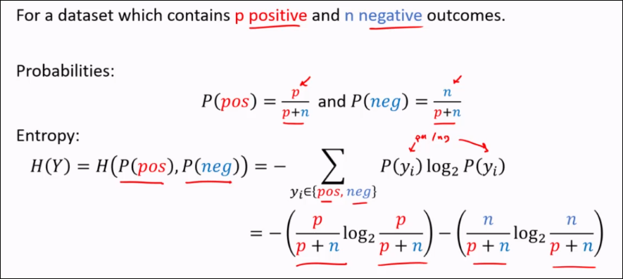
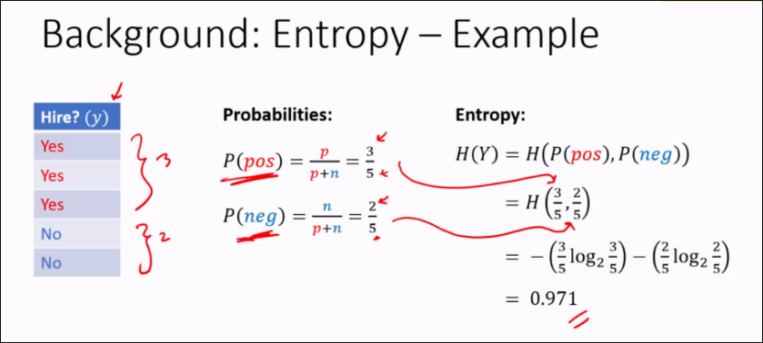
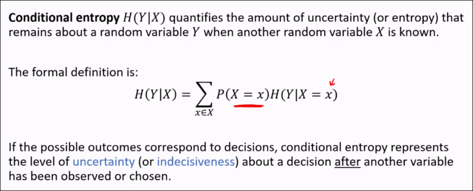
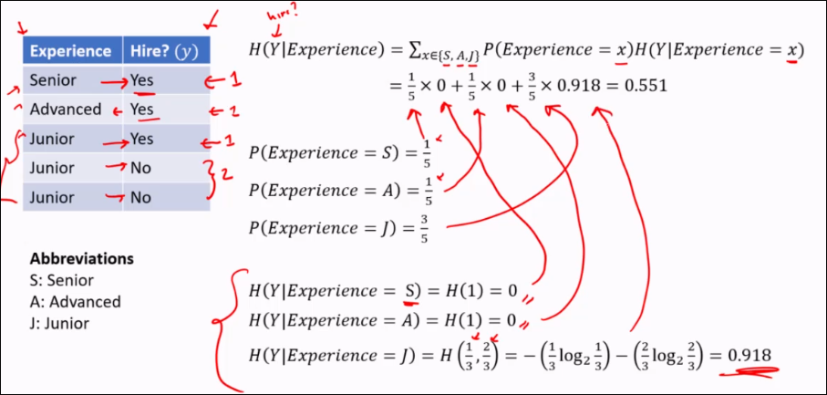
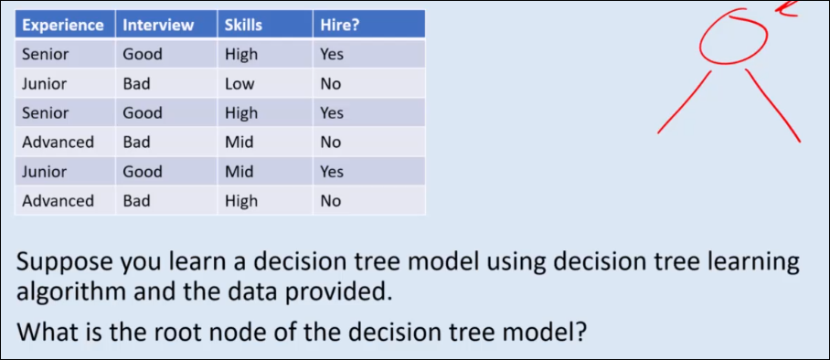

# Machine Learning
<panel header="Why?">
  Some problems are inherently <u>intractable</u> to solve, meaning no efficient solution exists for all cases.

  <br/>

  Other problems are difficult to solve because <u>formulating the rules</u> in a way the computer can comprehend and process is <u>challenging</u>:

  - Recognizing numbers in an image.
  - Answering open-ended questions.
  - Tasks requiring complex reasoning
</panel>

<panel header="What?">
  Subfield of AI that gives the computes the **ability to learn without explicitly being programmed**.

  It involves developing algorithms that can learn from and make predictions or decisions based on data.
</panel>

<panel header="Types of Machine Learning">

  - **Supervised Learning**: Learn from <u>labeled</u> data (input/output) pairs to learn a mapping from input to output
  - **Unsupervised Learning**: Learn from <u>unlabeled</u> data (input only) to find patterns or structures.
  - **Semi-supervised**
  - **Reinforcement Learning**

  

</panel>

<br />

## Learning Agents
Rather than solve the problem explicitly, construct an agent that <u>learns a function</u> to identify patterns in the data and make decisions.

## Supervised Learning
Involves:
- **Data**: A set of input-output pairs that the model learns from
  - Assume it represents the **ground truth**
- **Model**: A function that predicts the output based on the input features.
- **Loss**: A function that is used by a learning algorithm to assess the model's ability in making predictions over a set of data.

A **learning algorithm** is an algorithm that seeks to minimize the loss of a model over a training dataset. Used in the **training phase**.

After training, we usually test on an unseen **test set**. This is used to evaluate the model using various measures. This measures the **generalization** of the model.

### Tasks in Supervised Learning

#### Classification
* Objective: predict a <u>discrete</u> label - cat or dog?
* Output is a **categorical value**
* Cancer prediction, Spam detection

#### Regression
* Objective: predict a <u>continuous</u> numerical value based on input features.
* The output variable is a **real number**

### Data formulation
A dataset is represented as:

\[ (x^{(i)}, y^{(i)}) \], where

* $x^{(i)} \in \Reals^d$ is the input vector of $d$ features of the $i^{th}$ data point.
  * In general, $x^{(i)}$ can be a <u>multi-dimensional array</u> of features

- $y^{(i)}$ is the label for the $i^{th}$ data point.
  - **Regression**: $y^{(i)} \in \Reals$ for regression
  - **Classification**: $y^{(i)} \in {1, 2, .., K}$ for classification with $K$ classes.

Dataset $D$ with $n$ examples can be represented as:

\[ D = {(x^{(1)}, y^{(1)}), (x^{(2)}, y^{(2)}), ..., (x^{(n)}, y^{(n)})} \]

### Model
Refers to a function that maps from input to outputs: $h:X \rightarrow Y$. $h(x)$ should best predict the outputs given x.

### Performance Measure & Loss
**Performance Measure  & loss** functions take in a dataset $D$ and a model $h$ and returns a number representing how well $h$ predicts the mapping.

- **Performance measure**: is a metric that evaluates how well the model performs on a task. Used in evaluation/testing.
- **Loss function**: Quantifies the difference between the model's predictions and the true outputs. It's used by the model the guide learning to reach the optimal outcome.

#### Regression
**<u>Mean squared error (MSE)</u>**

\[ MSE = \frac 1 n \sum_n^{i=1} (\widehat{y}^{(i)} - y^{(i)})^2\]

<br />

**<u>Mean squared error (MSE)</u>**

\[ MAE = \frac 1 n \sum_n^{i=1} |(\widehat{y}^{(i)} - y^{(i)})|\]

$\widehat{y}$ represents the prediction of the model.
<small>These metrics can also be used as loss functions.</small>

#### Classification

**<u>Accuracy</u>**

\[ Accuracy = \frac 1 n \sum_{i=1}^n 1 (\widehat{y}^{(i)} = y^{(i)}) \]

<br />

**<u>Confusion Matrix</u>**



Measure TPR, TNR, FPR, FNR, etc.


## Learning Algorihtms
A learning algorithm A takes in a training set $D_{train}$, consisting of pairs, and seeks to find a model $h$ to approximate the true relationship between inputs and outputs. They can utilize loss functions to guide them.




<panel header="Example: Hiring Decision">

  
  
  This is a <u>classification</u>.


  
</panel>

# Decision Tree
A **decision tree** is a model that outputs a **categorical** decision or prediction. A decision is reached by <u>sequentially checking</u>  the **attribute value** at each node, starting from the root until a leaf is reached.

There generally exists <u>multiple</u> **distinct** DTs that are all consistent with the training data.

We prefer **COMPACT** decision trees, are they're less likely to be consistent with training solely due to **chance**

<panel header="Optimal decision trees">

  Finding an **optimal** decision tree is **NP-Hard**.

  We make the problem tractable by using <u>greedy</u> heuristics.

  Make locally optimal choices at each step by selecting the feature that yields the <u>immediate information gain</u>, to partition the data decisively.
</panel>

## Entropy 
**Entropy** quantifies the uncertainty or randomness of a random variable.


In binary outcomes, entropy is:




<panel header="Entropy Calculation Example">

  
</panel>

### Specific Conditional Entropy
**Specific conditional entropy** H(Y|X=x) is the entropy of a random variable Y conditioned on the discrete random variable X.

Simply fix the DRV, then calculate entropy as before.

### Conditional Entropy
It is simply the Expected Value - multiply the probability of a feature with the specific conditional entropy for each category x in X.






### Information Gain
Information gain is a measure of the <u>reduction</u> in **uncertainty** about a particular decision after knowing the value of a specific variable.

\[ IG(Y;X) = H(Y) - H(Y|X) \]

## Decision Tree Learning
Top-down, greedy, recursive algorithm.

- **Top-down**: Build the decision tree from the root.
- **Greedy**: At each step, choose the <u>locally optimal</u> attribute to split, such as based on immediate information gain, without considering future splits.
- **Recursive**: For each value of a chosen attribute, use DTL again on corresponding subset of data.

Stopping Criteria:
- No more data or attributes
- All data predicts the same class

### DTL - Functions
- `choose_attribute(attributes, rows)`
  - Accepts a set of attributes (columns) in the data, and the rows containing the data points.
  - Computes gain of each attribute
  - Returns the attribute that has <u>highest information gain</u>

- `majority_decision(rows)`
  - Accepts the table rows containing the data points.
  - Returns the most <u>common decision</u> in the data points.

### DTL - Base Case
1) No data available -> return default
2) Same classification for all rows -> return that classification
3) attributes is empty -> Take majority decision

```python
def DTL(rows, attributes, default):
  if rows is empty; return default
  if rows have the same classification:
    return classification
  if attributes is empty:
    return majority_decision(rows)

  best_attribute = choose_attribute(attributes, rows)
  tree = a new decision tree with root best_attribute
  for value of best_attribute:
    subrows = {rows with best_attribute = value}
    subtree = DTL(
              subrows,
              attributes - best_attribute,
              majority_decision(rows)
            )
    add subtree as a branch to tree with label value
  return tree
```

**Question**:
<question type="mcq" header="What is the root node of the DT model based on this data?">

  

  <q-option>
    Experience
  </q-option>
  <q-option correct>
    Interview
    <div slot="reason">
      The interview column cleanly maps to hiring outcome! This means entropy is zero.
  </div>
  </q-option>
  <q-option>
    Skills
  </q-option>
</question>

## DT analysis
### Theorem (Representational completeness of Decision Tree)
For <u>any</u> finite set of consistent examples with categorical features and a finite set of label classes, there exists a decision tree **that is consistent** with the examples.

But this is problematic. The DT then is prone to noise or outliers in excessively complex DTs - overfitting.

## DT pruning
**Pruning** refers to the process of removing parts of the tree. The goal is to produce a simpler, more robust tree that generalizes better.

Common pruning methods:
- **Max depth**: limits the maximum depth of the DT.
- **Min-sample leaves**: Set a minimum threshold for the number of samples required to be in each leaf node.
