# Linear Regression

## Task Formulation
N data points where where there are certain features that are all numeric.

\[ D = \{..., (x^{(n)}, y^{(n)})\} \]
where for all $i \in {1,..,n}$, features and targets are both $\in R$

 

To find a function that predicts the target y for a given x, is called **regression**

## Linear Models
<panel header="Linear Algebra (Background)">

  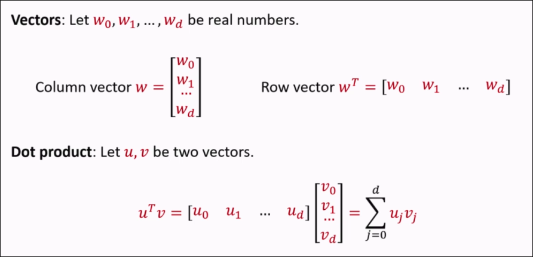

</panel>
Given an input vector $x$ of dimension $d$, a linear model is a function with the following form:

\[ h_w(x) = w_0x_0 + w_1x_1 + w_2x_2 + ... + w_dx_d \]

Where $w0,...,w_d$ are parameters/weights and $x_0$ = 1 is a dummy variable

Shorthand:

\[ h_w(x) = w^Tx =  \sum_{j=0}^d w_jx_j \]

A model is linear as long as it is some linear combination of weights - variables can be squared, even.

<panel header="Example">

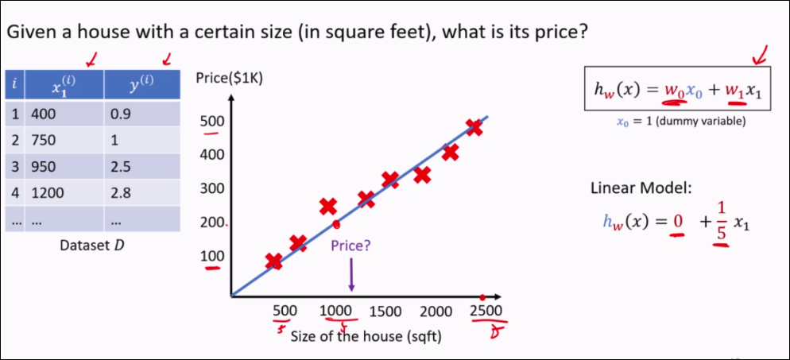

  In this case, we simply draw a best-fit line (y = mx + c) and use that as the function.
</panel>

 

There are **infinitely many** linear models that could represent the relationship between input x and output.

We want a linear model with the <u>lowest</u> loss on the data - commonly use **mean squared error**

TODO: Include mean squared error loss here.

**Question**:
<question type="mcq" header="Select The correct statements">

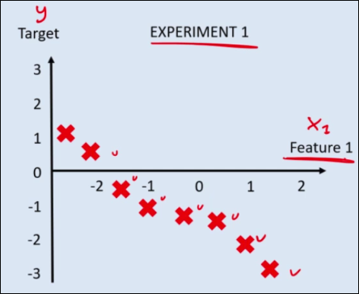

  <q-option>
    Linear regression is used when the **target** is a **categorical** variable
  </q-option>
  <q-option>
    In linear regression, we need to find **features** such that they fit to the weights of the linear model.
  </q-option>
  <q-option>

For EXPERIMENT 1, the best linear model will have $ w_0 > 0 $
  

      I don't know dawg
  

  </q-option>
  <q-option correct>
    For EXPERIMENT 1, the best linear model will have $w_1$ < 0
    

      The slope is clearly going downwards! 
  

  </q-option>
  <q-option>
    None of the above.
  </q-option>
</question>

<panel header="## Background" type="seamless">

### Gradient and Partial Derivative

Suppose you have a function:

\[ h_w(x) = w_0x_0 + w_1x_1 + w_2x_2 + ... + w_dx_d \]

The **gradient** of the function is the partial dervative of h(w) wrt each $w_i$. Simplified:

\[ [ x_1, x_2, ..., x_d ]^T \]

<panel header="Full partial derivative formulation">

  

</panel>

 

###  Minimizing a Function
Suppose you have a 1-dimensional scalar function of variable w, with scalars x and y.

\[ f(w) = \frac 1 2 (wx - y)^2 \]

The **minimum** of this function is when the **gradient** $\Delta f(w) = 0$

\[ \Delta f(w) = (wx - y)x \]
\[ 0 = (wx - y)x \]
\[ w = \frac y x \]

For a d-dimensioned variable $w = [w_1, ..., w_d]^T$, the **minimum** of the function satisfies that the partial derivative is equal to 0 for all $w_i$

### Matrices

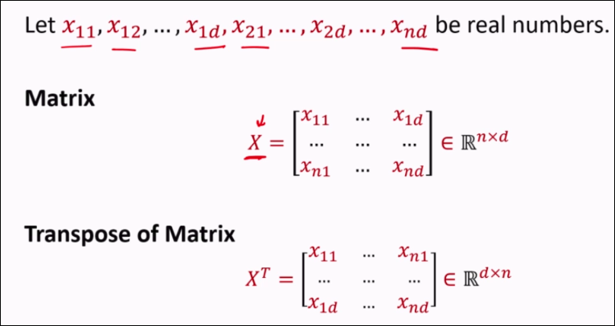

### Gradient and Minimum

Suppose you have the following function:

  \[ f(w) = (w_1)^2 + (w_2)^2 \]

  The gradient is:

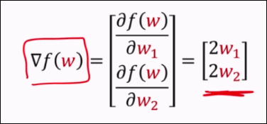

Notice that the gradient vector is pointing <u>away</u> from the minimum of f(x) @ $w_1 = w_2 = 0$

</panel>

 

## Learning via Normal Equations
### Viewing input/output as a matrix

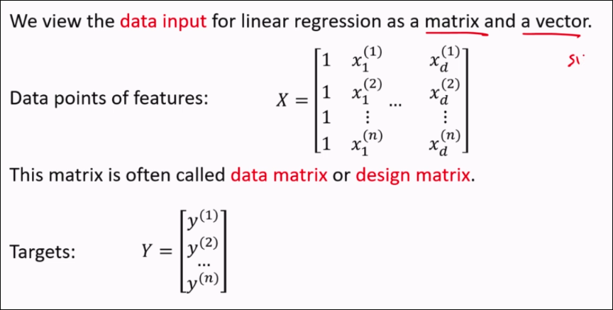

### The Normal Equation
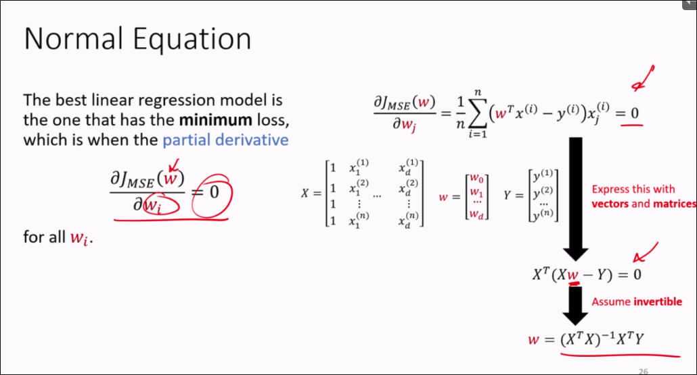

However, the normal equation has its problems:
- The cost of the normal equation is d^3 (for inverting the matrix)
- It will <u>not</u> work if $(X^TX)^{-1}$ is **not invertible**
- It will <u>not</u> work for **non-linear** models

## Learning via Gradient Descent
- Start at some $w$
- Update $w$ with a step in the <u>opposite</u> direction of the gradient:

\[ w_j \leftarrow w_j - \gamma \frac {\delta(w_0, w_1, ...) } {\delta w_j} \]

- Learning rate $\gamma > 0$ is a hyperparameter that determines the step size.
- Repeat until termination criteria is satisfied.

<panel header="Gradient Descent Example">

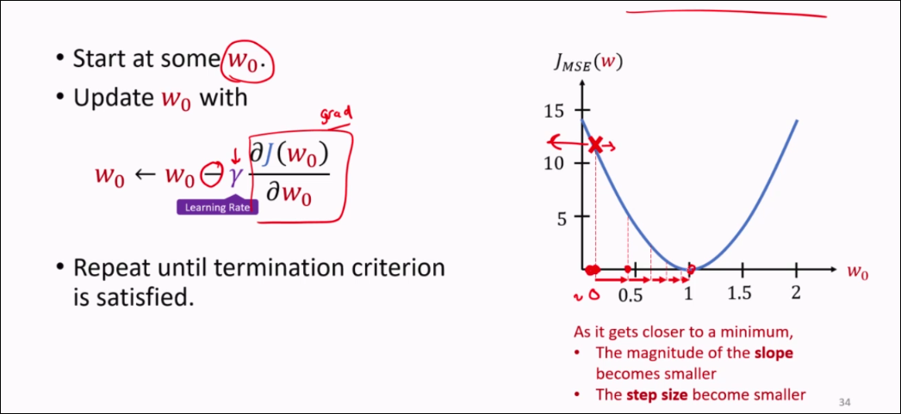

</panel>

 

### Multi-Variable Gradient Descent

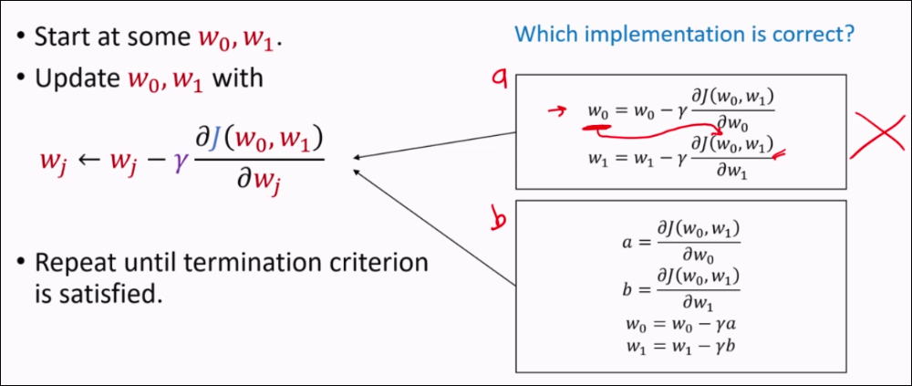

You have to update both at the same time, if not the first operation spoils the result of the 2nd equation

### Gradient Descent - Analysis
<panel header="Convexity">

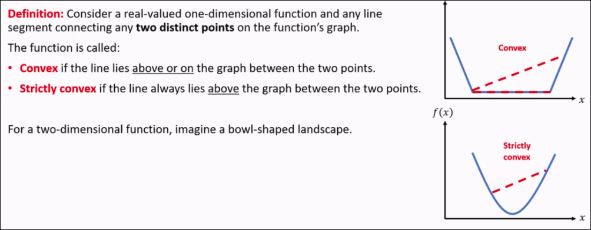
**Theorem 1**: For a <u>convex</u> function, <u>any</u> local minimum is also a global minimum.
**Theorem 2**: A <u>strictly convex</u> function has at most <u>one unique</u> global minimum.

</panel>

**Theorem**: MSE loss function for a linear regression model is a <u>convex</u> function with respect to the model's parameters.

**Definition: Linearly dependent features**: A feature is <u>linearly dependent</u> on other features, if it is a linear combination of the other features. E.g. $x_3 = c_1x+1 + c_2x+2$

**Theorem**: If features in the training data are **linearly independent**, the function (MSE + Linear model) is <u>strictly convex</u>

And thus,

**Theorem**: For a linear regression model with a MSE loss function, the **Gradient Descent** algorithm is guaranteed to converge to a **global minimum**, provided the <u>learning rate is chosen appropriately</u>. If the features are linearly independent, then the global minimum is unique.

### A problem with Gradient Descent
Let's say we have j(w) given data 2 datapoints with 2 dimensions and 1 target variable:

\[ j(w) = (w_1x_1^{(1)} + w_2x_2^{(1)} - y^{(1)}) + (w_1x_1^{(2)} + w_2x_2^{(2)} - y^{(2)}) \]
\[ = (w_1)^2 + (10w_2)^2 \]
(after subbing in values)

Then, it's gradient is given:

\[\nabla J(w) = \begin{bmatrix} \frac{\partial J(w)}{\partial w_1} \\ \frac{\partial J(w)}{\partial w_2} \end{bmatrix} = \begin{bmatrix} 2w_1 \\ 200w_2 \end{bmatrix}\]

Gradient descent update is then given:

\[ w_1 \leftarrow w_1 - \gamma2w_1 \]
\[ w_2 \leftarrow w_2 - \gamma200w_2 \]

 

This causes a problem, because we then have the gradient given by the graph:

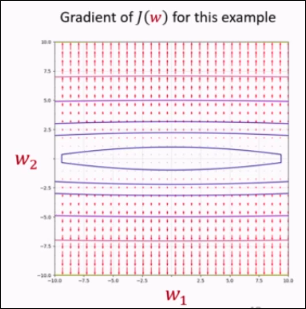

The gradient change for $w_2$ is then done by a factor of **100** times, as the same learning rate is applied to both variables. This can cause overshoot when performing descent.

#### How to fix this?
- Min-max scale the features to be within [0, 1]
- Standardize the data based on the mean
- Use a different learning rate for each weight

### Other problems in Gradient Descent
- **Slow** for large datasets, since the <u>entire</u> dataset must be used to compute the gradient.
- May get stuck at a **local minimum/plateu** on non-convex optimization.

- Use a subset of training examples at a time (Mini-batch GD). Cheaper/Faster per iteration.
- Stochastic Gradient Descent - select one random training example at a time.

# Linear Regression Summary

# Feature Transformation
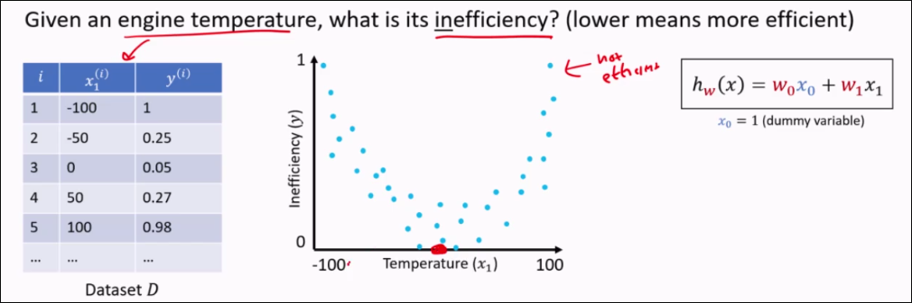

Take a d-dimensional feature vector and transform it into an M-dimensional feature vector, where usually $M>d$.

\[ x \in \reals^d \rightarrow \phi(x) \in \reals^M \]

Where,
- The function $\phi$ is called a **feature transformation/map**
- The vector $\phi(x)$ is called the **transformed features**

<panel header="Examples of feature transformations">

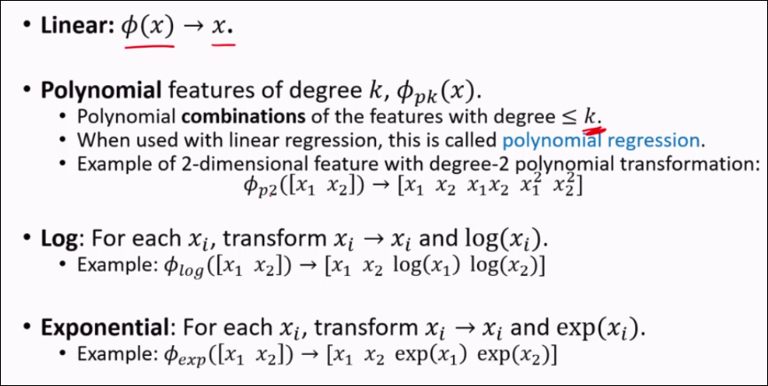

  Note an extra condition for polynomial regression - maximum degree will be $n-1$ where $n$ is the amount of rows in the dataset. This is because a degree of $\gte n$ will make the resultant matrix non-invertible.

</panel>

<panel header="Using linear regression with feature transformation">

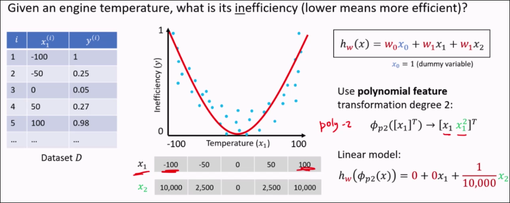

  Here, we use square to make values positive s.t. the graph becomes linear:

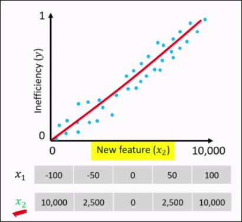

  From the perspective of X2, the data is linear.

</panel>

**Theorem**: The <u>convexity</u> of linear regression with MSE is preserved with feature transformation.

TODO:
Interpretation of that partial derivative shit (how to perform gradient-descent related)
What a minimizer is
MSE/MAE tutorial? LR.
ACC/PREC/F1 Score
