# Logistic Regression
Helps with classification problems.

## Data Formulation
* We are given *n* data points.
* Each data point consists of features and a target variable
* Each data point has d features and they are described by real numbers
* The target is {0,1} where 0 is "negative" and 1 is the "positive" class

In formal math notation:
\[ D = \{..., (x^{(n)}, y^{(n)})\} \]

where for all i $\in \{1,...,N\}$

Features: $x^{(i)} \in \Reals^d$

Targets: $y^{(i)} \in {0,1}$

<panel header="Example question">

  
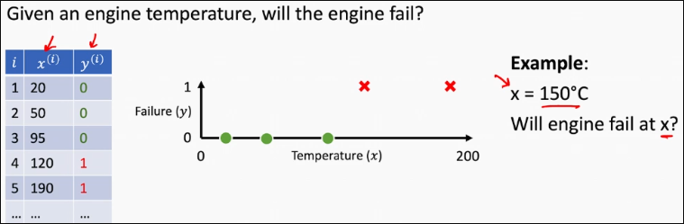
</panel>

## The logistic model

<panel header="Background: The Sigmoid function" type="seamless">

</panel>

<panel header="Background: Probability" type="seamless">

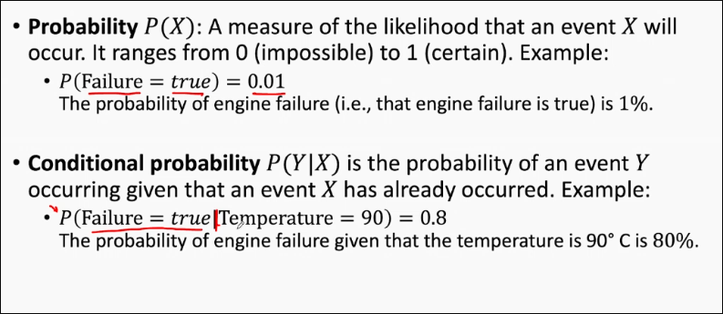
</panel>

Given an input vector x of dimension d, a logistic model is a function with the following form:

\[ h_w(x) = \sigma(w_0x_0 + w_1x_1 + ... + w_dx_d) \]

Where $w_x$ are parameters, $x_0 = 1$, and $\sigma$ is the sigmoid function

We can shorthand this to the dot product:

\[ h_w(x) = \sigma (w^Tx) = \sigma(\sum_{j=0}^d w_jx_j) \]

### Classification with the Logistic Model

The logistic model outputs a real number in the range [0,1].

* We treat this as a **confidence score** of the model.

To decide whether an input belongs to a certain class, we compare the probability output to a **decision threshold $\tau$**

<panel header="Engine Failure Example">

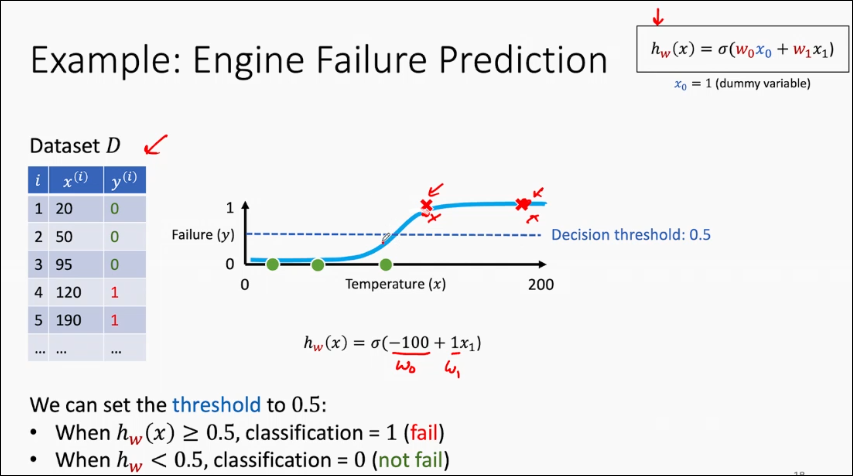
</panel>

### The decision boundary
A **decision boundary** is a surface (or line/hyperplane) that <u>separates</u>  the different classes in the feature space.

* It is an <u>intersection</u> between the **model's function** and the **decision threshold**
* It defines the points where the classification model changes its prediction from one class to another.

### Finding the best logistic model
Again, there are **infinitely many** logistic models. We want one with the <u>lowest</u> **loss** on the data.

However, we can't use MSE - a key property of MSE is that the function needs to be convex.

Theorem: MSE loss function is <u>non-convex</u> for logistic regression.

<panel header="Background: Cross-Entropy" type="seamless">

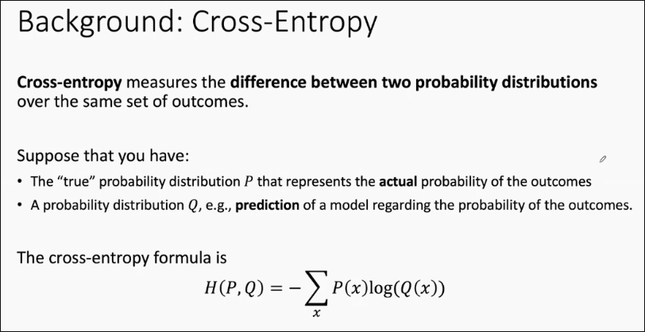
</panel>

<panel header="Background: Binary Cross-Entropy" type="seamless">

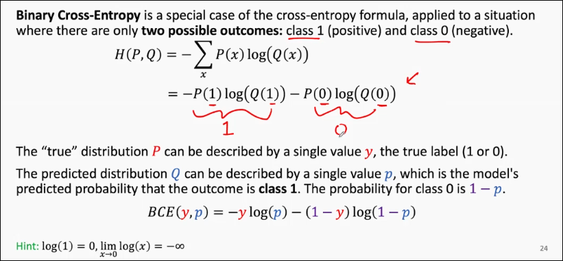
</panel>

## Binary Cross-Entropy Loss

\[ J_{BCE}(w) = \frac 1 n \sum_{i=1}^n BCE(y^{(i)}, h_w(x^{(i)}) \]

* Logistic Regression = logistic model + BCE loss
* The loss is known as log loss
* $J_{BCE}$ is a function of **w**; we want to find a w that minimizes the loss!

### Convexity of loss function
 
Theorem: BCE loss function for a logistic model is a <u>convex</u> function wrt. model's paramters.

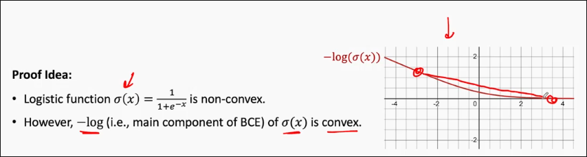

### Impossibility of learning via Normal Equation

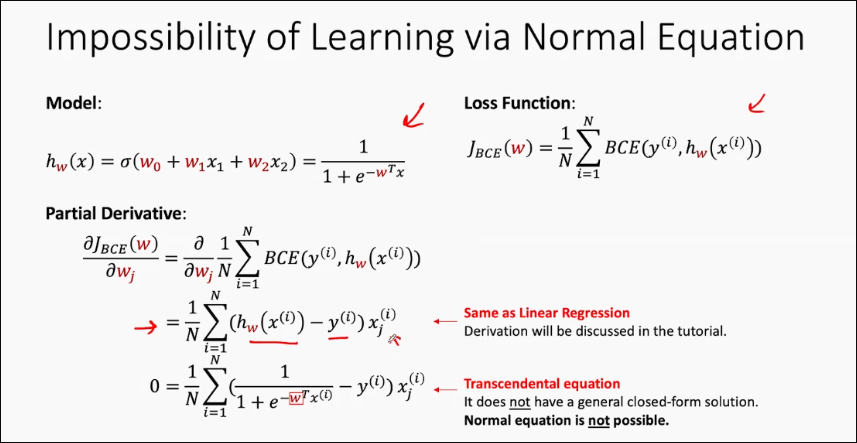

## Learning via Gradient Descent

Todo: RECAP gradient descent.

Recall the model and our loss function. We have a clean partial derivative:

\[ \frac {\delta J_{BCE}} {\delta w_j} = \frac 1 N \sum_{i=1}^N (h_w(x^{(i)} - y^{(i)})x_j^{(i)}) \]

Then, our weight update function:

\[ w_j \leftarrow - \gamma \frac {\delta J_{BCE} (w_0, w_1, ...)} {\delta w_j} \]

**Theorem**:
For a logistic model with a BCE loss function, the **Gradient Descent** algorithm is guaranteed to converge to a **global minimum**, provided the <u>learning rate is chosen appropriately.</u>

**Question**:
<question type="mcq" header="Select The correct statements">

  <q-option>

  Logistic regression is used when the **features are categorical**
  

      The correct statement is that features are <u>real-valued</u>
  

  </q-option>
  <q-option>
    In logistic regression, MSE minimization will find a global minimum.
  

  We need to use **BCE** over MSE.
  

  </q-option>
  <q-option>

  For EXPERIMENT 2, the targets y $\in$ [0,1] prevents us from using logistic regression
  </q-option>
  <q-option>

  For experiment 2, the best logistic model will have $w_1 > 0$
  

  Actually, $w_1 < 0$ - think of $\sigma(-x)$. Also, the slope is negative.
  

  </q-option>
  <q-option correct>
    None of the above.
  </q-option>
</question>

## Feature Transformation
Some data is not **linearly separable** - that is, there is no single linear decision boundary that separates the class. In such cases, the sigmoid function does not cleanly work. 

When this is the case, the decision boundary required to separate the classes needs to be <u>non-linear</u>:
* Use non-linear models
* Use **non-linear feature transformations**

RECALL: Feature transformation (TODO)

<panel header="Example - engine failure with tranformation">

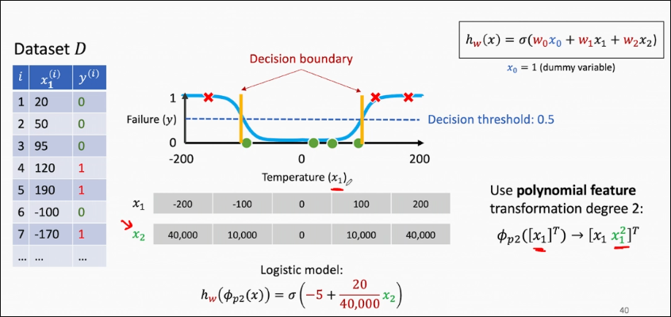

  Looking at it by the perspective of $x_2$, we get a single decision boundary:

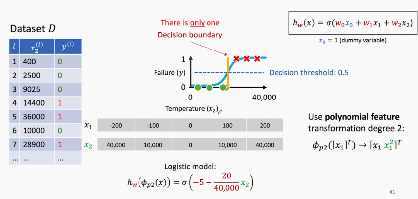
</panel>

**Theorem**: The <u>convexity</u> of logistic model with BCE is preserved **with feature transformation**.

## Multi-Class classification

Suppose:
* The target is {1, 2, ..., K} where K is the number of classes.

Find a model that predicts the target y $\in$ {1,2,...,K}

To do this with only binary classifiers, we have two approaches.

### One-vs-One
For every pair of classes, we have 1 binary classifier.

This means we will have $\frac {K(K-1)} 2$ binary classifiers.

Each classifier votes for a class, and the class with the **most votes** is selected.

<panel header="example">

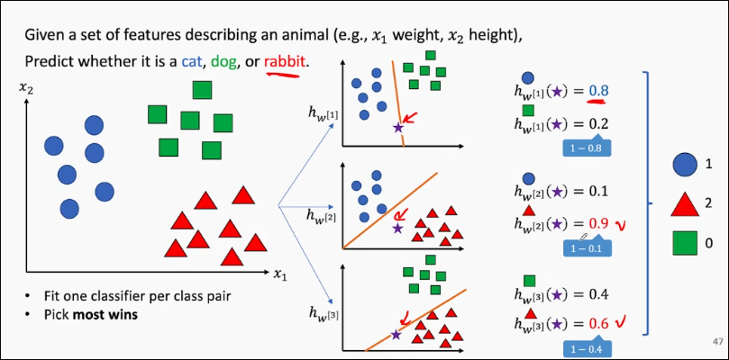
  </panel>

### One-vs-Rest
For each class, treat one class as the target and combine all other classes into an "rest" class.

We will then have **K** binary classifiers.

The classifier with the **highest probability** output determines the class.

<panel header="example">

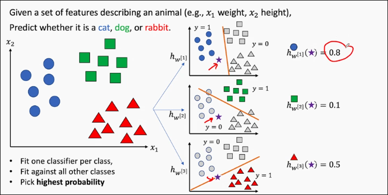
  </panel>

## Multi-Label classification
Suppose:
The target is {0,1}^K where K is the number of classes.
    * The target is a subset of labels/classes

Find a model that predicts the target $ y \in {0,1}^K$ for that x.

How to do this with binary classifiers?

### Common Techniques
* Tranformation to binary classification problem
    * **Binary relevance**: Train one independent binary classifier per label (One-vs-rest). Ignores label correlations and constraints. However, this ignores label correlations and constraints - for example, we can't model mutual exclusitivity.
    * The idea of relevance can be extended to **non-binary** classifiers - e.g. levels of diabetes, severity of blood pressure
    * **Classifier Chain**: Like Binary Relevance, but feed predictions of previous labels as features for subsequent labels.

* Transformation into multi-clsas classification problem.
    * **Label Powersect**: Treat each unqieu label-set as a single multiclass label. Preserves correlations, but number of classes explode and can be data-sparse.

## Generalization
*  Recall: in supervised learning and ML, the model's performance on **unseen data** is all we care about. This ability to perform well on new, unseen data is known as generalization capability.
* Here we assume that all the training and test data comes from the same unknown <u>ground truth</u>
* Measuring a model's error is a common practice to quantify the performance of the model This error, when evaluated on unseen data, is known as the generalization error.
* There are two factors that affect generalization: **dataset** (quality and quantity), and **model** complexity.

### Dataset quality
* **Relevance** : Dataset should contain relevant data - features that are required for solving the problem.
* **Noise**: Dataset may contain noise (irrelevant/incorrect data) which can hinder learning
* **Balance**: For classification, balanced datasets ensure that all classes are adequately represented.

### Dataset Quantity
In general, more data typically leads to better model performance, provided the model is expressive enough.

**Extreme case**: If the dataset contains every possible data point, the model does not even need to make predictions.

### Model Complexity
* Refers to the **size** and **expressiveness** of model functions
* Indicates how intricate the relationships between input and ouptut variables that the model can capture.
* Higher model complexity allows for more sophisticated modelling of input-output relationships.

In a very simple example, A polynomial regression model (a curve) has a higher complexity than a linear regression model (a straight line). Thus, it can model more complicated data.

#### TODO: Case study with simple model
Too-simple models on complex data leads to **high bias** and a phenomenon called **underfitting**

Retraining a simple model with a different training set sampled from the same ground truth leads to essentially the same model - we call the model to have **low variance**

#### TODO: Case study with complex model
When data is scarce, complex models **overfit** the training data, leading to incorrect predictions.

When data is abundant and noise is minimal, complex models can fit both simple and complex data - **low bias**

Retraining a complex model with a different training set from the same ground truth can lead to a vastly different model, exhibiting high variance.

#### TODO: Model Complexity and Data Quantity vs Error

## Hyperparameters
* **Hyperparameters** are <u>settings</u> that control the behaviour of the training algorithm and model, but are not learned from the data. They need to be set before the training process begins.
    * Learning rate
    * Feature transformation
    * Batch size, # iterations
* Hyperparameters v.s. Parameters
    * Parameters are learned during training (e.g. weights)
    * Hyperparameters are predefined and adjusted manually
* Hyperparmater tuning/search
    * Is the process of <u>optimizing the hyperparmeters</u> of a ML model
    * We use an additional validation set for tuning.

### Techniques for tuning
* **Grid Search**:
    * All possible combinations of a predefined set of hyperparameters are exhaustively tried.
    * E.g. Learning rate 0.1, 0.5, 1.0 and regularization: L2, L3 - generates all combinations
* **Random Search**:
    * Randomly select from a predefined distribution. Does not try every possible combi.
* **Local search**:
    * Use local search algorithms, such as hill-climbing, to iteratively optimize the hyperparameters.
    * State will be, for example, learning rate and polynomial degree.
    * Objective/Evaluation function will be the loss or performance measure of the model.
* **Successive halving, Bayesian optimization, etc...**

